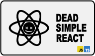

# dead-simple-react

### Leaving that bloat at home.

Dead simple, advanced examples to learn how to love react.

---

## To-do App - Principles

 
Add to-do

A form that submits to-dos to a list.

- uses a controlled input
- input field is required
- input field clears after form submit

 
Complete to-do

A completable to-dos list.

- uses a controlled input of type checkbox
- uses `map()` to toggle each todo's completed state
- uses inline-styling to show if completed

 
Delete to-do

A deletable to-do list.

- uses `filter()` method to delete item
- has no confirm message

 
Edit to-do

An editable to-do list.

- uses `map()` method to toggle if todo is in edit mode
- edit mode swaps span with input
- input controlled by todo name
- changes are directly written into the state

> this is dead simple - but edit mode should not be in the data we mock as a database, better keep your data structure clean from states that are only needed to render on the frontend.

---

## To-do App - Advanced

 
Add to-do - multiple inputs

A form that submits to-dos with multiple values to a list.

- uses `new FormData()` instead of controlled inputs

 
Delete to-do - confirm message

A deletable todo list that asks for confirmation before deleting.

- uses custom component
- uses "Lifting up State"

 
Delete to-do - move to trash

A deletable todo list that moves item to trash list.

- marks a to-do for trash

 
Edit to-do - keeping data clean

An editable to-do list with nested edit mode toggle.

- uses custom component
- uses "Lifting up State"
- keeps data structure clean from an items edit state
- uses formData and controlled input

 
Save to-do - using localStorage

A todo-list that is saved in your localStorage.

- uses `localStorage.setItem()`
- uses `localStorage.getItem()`

> Note that this solution will not work in a ssr environment. For ssr use `useSyncExternalStore` or a dedicated library.

 
Sort to-do - swapping neighbors

Todo-list which allows you to swap neighboring to-dos.

- clones the state array to make it mutable

> If you are looking for a better solution, you probably want to take a look at `splice()`method.

---

## To-do App - Disguised

 
Color Palette Creator

A form that submits colors to a list from where you can copy the hex codes.

- text and color input are using the same useState
- uses async function `navigator.clipboard.writeText()`

> Depending on the browser, this will throw an error in Codesandbox's editor-mode, but will most likely work if you open the app in a new window.

 
Budget Planner

A form that submits expenses and calculates a budget.

- uses a loading bar to display rest budget
- uses controlled inputs
- uses `Number.parseFloat()`
- uses `Math.round()`
- size at where you should split up custom components

 
Speech Synthesizer

A form that says what you submit to a list from which you can say it again.

- uses Web Speech API
- uses your browsers default language/voice

 
Review Writer

A form that submits 5-star reviews.

- uses `Array.from()`

---

## Fetching

 
Fetching - nested fetching

Fetch that receives data including another url you need to fetch.

- uses async/await
- uses a loading state

 
Fetching - handling race conditions

Fetch with pagination that handles race conditions.

- uses async/await
- uses pagination to fetch
- uses a cleanup function in useEffect to set an ignore flag

> While fetching with pagination it is not guaranteed, that responses arrive in the same order we request them, so we manually take care, that the last request will always be the last no matter if it responded faster than an earlier request.

---

## Custom Hooks

 
useMousePosition

Custom hook that returns the position of the mouse.

- uses `window.addEventListener()` and `window.removeEventListener()`
- uses a cleanup function in a useEffect
- one of the most easiest self written hooks

 
usePagination

Custom hook you can use to implement pagination.

- returns an object with 4 values
- returns current page
- returns function for next and previous page
- returns function to set a specific page

---

## styled components

 
Typography-Component

Custom component that returns styled text components depending on the props you pass.

- similar to [mui's Typography Component](https://mui.com/material-ui/react-typography/)
- can be used for every piece of text in your app
- accepts `children`, `variant`, `component` and every other prop you want to use

> Setting component (semantic) independently from variant (styling) separates concerns.

