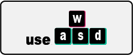

# How to Contribute

Just export the Codesandbox as zip, unpack it and copy it to the right directory.

Fork this repository and put a pull request against it.

---

## Contributions are highly welcome for:

- key points
- code comments
- typos and wrong english
- advanced react examples
- advanced famous library examples

---

## Keep the following guidelines in mind:

- no unnecessary styles
- no unnecessary semantics
- no unnecessary a11y
- comments mainly on advanced react concepts
- stick to the prevailing formatting
- do not tell stories

---

## You don't feel addressed?

Wanna talk about it?

---

## Also responsible for:

### use-wasd

